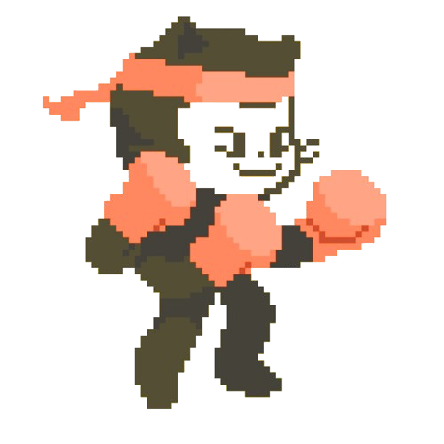

### Hi there 👋

<table style="border: none;">
  <tr style="border: none;">
    <td style="border: none;">
      <ul>
        <li>
          🔭 I’m currently studying at **SENA**
        </li>
        <li>
          🤝 I’m looking to collaborate on Open Source Proyects
        </li>
        <li>
          🌱 I’m currently learning Django & NestJS; 
        </li>
        <li>
          👨🏻‍💻 Most of my projects are available on 
        </li>
        <li>
          💬 Ask me about anything tech related, I am happy to help (if you have questions with linux you can ask me🐧);
        </li>
        <li>
          📫 Feel free to contact me on 
        </li>
        <li>
          📝 Checkout my 
        </li>
    </td>
    <td style="border: none;">
      
    </td>
  </tr>
</table>

I am kirtan kanani Master's student at the University of Waterloo.

